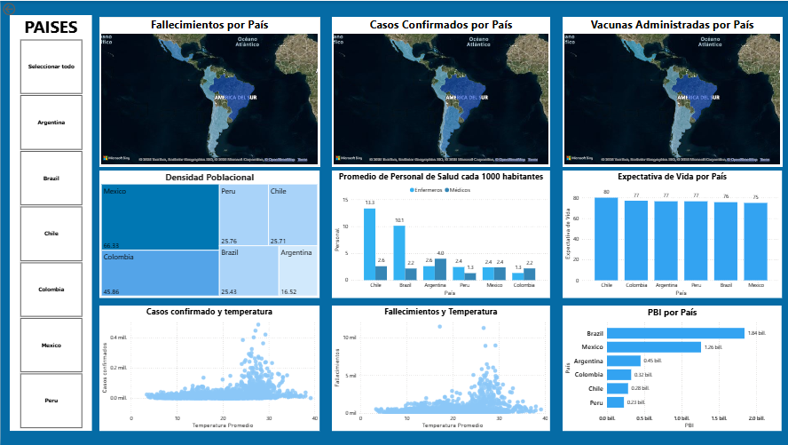

# 🧬 Biogenesys: Análisis de Expansión Estratégica en LatAm

## 📖 Descripción del Proyecto

**Biogenesys**, una empresa farmacéutica líder, busca expandir sus laboratorios en Latinoamérica para optimizar la respuesta ante situaciones sanitarias futuras. Como Data Analyst, fui contratado para identificar las ubicaciones óptimas para esta inversión, basándome en datos históricos y actuales de salud pública.

El objetivo principal fue analizar la incidencia del COVID-19, las tasas de vacunación y la infraestructura sanitaria en 6 países clave: **Colombia, Argentina, Chile, México, Perú y Brasil**.

## 🎯 El Desafío de Negocio

La directiva necesitaba tomar decisiones basadas en datos (Data-Driven Decisions) para responder a las siguientes interrogantes:
* ¿Qué países fueron los más golpeados por la pandemia y requieren mayor refuerzo?
* ¿Dónde existen brechas en la infraestructura sanitaria o vacunación?
* ¿Cuál es la ubicación estratégica más eficiente para instalar nuevos laboratorios?

## 🛠️ Stack Tecnológico

Para este proyecto utilicé un enfoque híbrido, aprovechando la potencia de Python para el procesamiento y Power BI para la visualización.

* **Python (ETL & EDA):**
    * `Pandas` & `NumPy`: Carga, limpieza y transformación de los datasets crudos.
    * Manejo de valores nulos, normalización de fechas y cruce de datos poblacionales.
    * `Seaborn`, `Matplotlib` & `GeoPandas`: Análisis Exploraorio de los Datos
* **Power BI (Dashboard):**
    * Modelado de datos (Relaciones entre tablas).
    * Creación de medidas DAX para KPIs dinámicos.
    * Diseño de Dashboard interactivo para la junta directiva.

## 📊 Metodología y Flujo de Trabajo

### 1. ETL (Extracción, Transformación y Carga) - *Python*
Se procesaron datasets conteniendo registros de casos, fallecimientos y vacunación.
* **Limpieza:** Se eliminaron registros inconsistentes y se imputaron valores faltantes en métricas no críticas.
* **Transformación:** Se estandarizaron los formatos de fecha.

👉 *Puedes ver el código del proceso en el archivo [`PIDA_M4_Francisco_Hillebrand.ipynb`](./PIDA_M4_Francisco_Hillebrand.ipynb)*.

### 2. Análisis Exploratorio (EDA)
Se identificaron patrones de estacionalidad en los contagios y correlaciones entre la tasa de vacunación y la disminución de la letalidad en los países objetivo.

### 3. Visualización y Reporting - *Power BI*
Se construyó un Dashboard estratégico centrado en la usabilidad para los directivos.

> **Vista Previa del Dashboard:**
>
> 
> *(Asegúrate de subir la imagen a la carpeta del repo y cambiar este nombre)*

## 💡 Insights y Resultados Clave

Tras el análisis de los datos, se presentaron las siguientes conclusiones a la directiva de Biogenesys:

1.  **Brasil como Prioridad:** Fue identificado como el país con mayor incidencia absoluta y desafíos en la gestión sanitaria, convirtiéndolo en el candidato #1 para la instalación de infraestructura de soporte para maximizar el impacto.
2.  **Correlación de Vacunación:** Se evidenció que los países con campañas de vacunación (como Chile) mostraron una curva de letalidad descendente más rápida, sugiriendo que la inversión en logística de vacunas es tan crítica como la de laboratorios.
3.  **Estacionalidad:** Se detectaron picos de contagio coincidentes con temperaturas cálidas, permitiendo prever cuándo se necesitará mayor capacidad operativa.

## 📁 Estructura del Repositorio

* `/Data`: Contiene los datasets procesados (si son públicos) o una muestra de ellos.
* `PIDA_M4_Francisco_Hillebrand.ipynb`: Notebook con el proceso de ETL y EDA en Python.
* `Informe_Biogenesys.pdf`: Informe ejecutivo detallado con hallazgos y narrativa.
* `Dashboard_Biogenesys.pbix`: Archivo fuente de Power BI.

---
**Autor:** Francisco Javier Hillebrand
